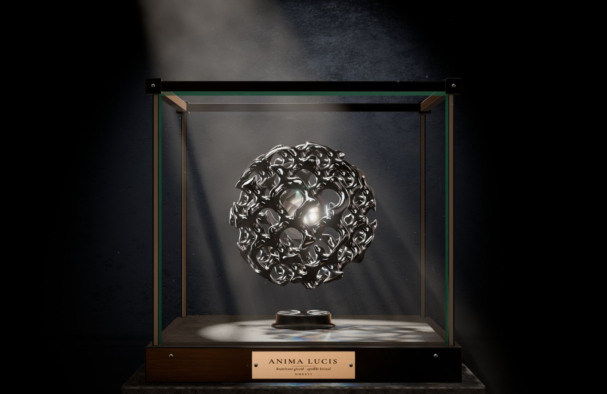
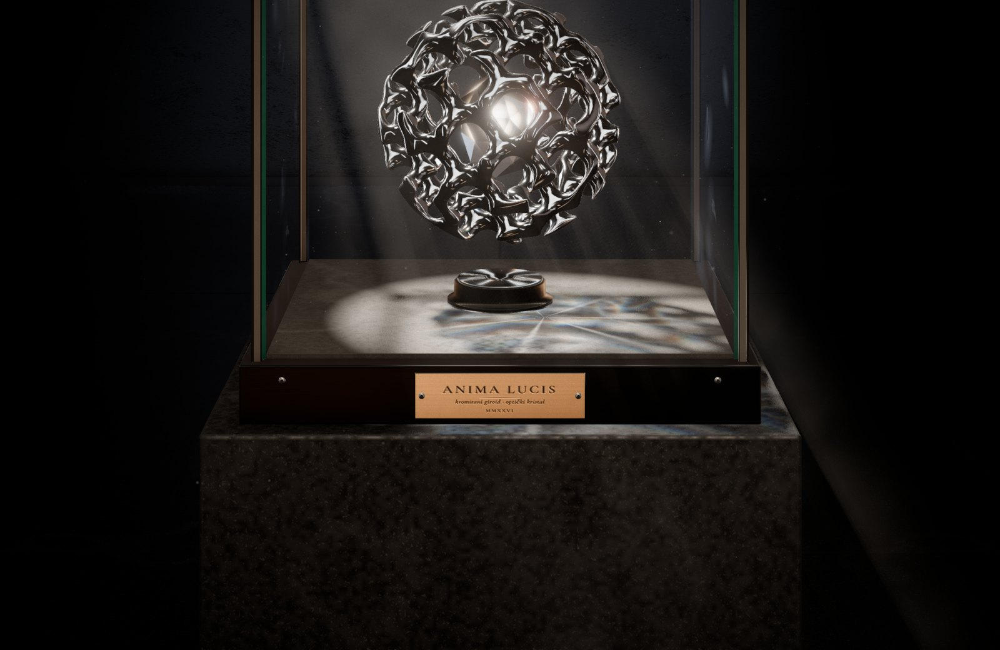
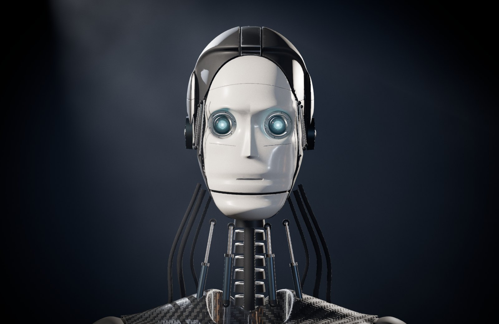

# Ekran kao prozor — head-tracking 3D

Web demo **head-coupled perspective** projekcije: web kamera prati položaj tvojih očiju,
a 3D scena se iscrtava off-axis projekcijom tako da se monitor ponaša kao **prozor** —
kad pomakneš glavu, perspektiva se mijenja kao u stvarnosti (efekt Johnny Lee /
Sony Spatial Reality Display).

**Živo:** https://artme-nx.github.io/head-tracking-3d/

| Muzejska vitrina | Odozgo (kaustike, sjena rešetke) | Robot |
| --- | --- | --- |
|  |  |  |

Stack: Vite + vanilla JS + Three.js, MediaPipe Tasks Vision (FaceLandmarker),
Spark (`@sparkjsdev/spark`) za Gaussian splatove, pmndrs `postprocessing` + N8AO
za AAA scene, meshoptimizer za generiranu geometriju.

## Scene

| Tipka | Scena |
| --- | --- |
| `1` | **Kutija** — klasična Johnny Lee kutija s mrežom i metama (jedna izlazi ispred ekrana) |
| `2` | **Model** — glava na postolju, studijsko svjetlo; prima vlastiti .glb/.gltf/splat |
| `3` | **Muzejska vitrina** — tamna galerija, stakleni kubus, kromirana giroidna sfera s kristalnom jezgrom |
| `4` | **Robot** — hard-surface android poprsje čije mehaničke oči gledaju točno u tvoje oči |

### 3 — Muzejska vitrina "Anima Lucis"
- Kromirana sfera od **giroidne (TPMS) rešetke** generirane u web workeru: SDF → marching cubes →
  meshoptimizer → normale iz gradijenta SDF-a (savršeno glatki odsjaji kroma).
- **Kristalna jezgra** s lomom svjetla, kromatskom disperzijom (zaseban IOR za R/G/B) i iridiscencijom;
  jezgra se vrti suprotno od sfere i "diše".
- Prava **staklena vitrina**: Fresnel refleksije galerije, vrlo suptilne mrlje i prašina, zelenkasti rubovi
  stakla, okvir od brušene tamne bronce s vijcima i spojevima, mesingana pločica s graviranim nazivom djela.
- Muzejski spot uskog snopa s **volumetrijskim haze-om** (raymarch s 3D šumom i pravom sjenom rešetke →
  zrake svjetla kroz rešetku), lebdeće čestice prašine (neke ispred ravnine ekrana), **animirane kaustike**
  kristala projicirane na dno vitrine, PCSS sjene, kontaktne sjene, polirani kameni pod s planarnim
  refleksijama koje su geometrijski točne za položaj tvoje glave.

### 4 — Robot
- Glava od zasebnih keramičkih/karbonskih panela s **pravim procjepima** (SDF ljuske), kroz procjepe na
  sljepoočnicama vidi se mehanika; panel linije, natpisi i serijski brojevi; mehanički vrat s kralješcima,
  hidraulikom (klipnjače klize), pletenim kabelima i rebrastim crijevom.
- **Oči** su slojevi prave geometrije: duboka duplja s vijcima → kućište → objektiv s gravurom →
  iris-blenda od 11 lamela → emisivni prstenovi na različitim dubinama → užarena jezgra → staklena
  rožnica s AR prevlakom → mehanički kapci. Svjetlo iz očiju je pravo svjetlo (obasjava duplju i lice).
- Oči gledaju **točno u 3D položaj tvojih očiju** (konvergencija za blizu/daleko), uz sakade (kratki
  pogledi na tvoje lijevo/desno oko i usta), mikrosakade i tremor. Glava i vrat slijede s kašnjenjem i
  inercijom (opruga s prigušenjem i "servo" mrtvom zonom). Kad se približiš, blenda se sužava i jezgra
  posvijetli. Povremeno trepće kapcima ili zatvaranjem blende; suptilno "diše".
- `E` mijenja boju očiju: ledeno cijan ↔ jantarna.
- **Vlastita glava:** dok si na sceni 4, ispusti .glb/.gltf glave — model sjeda na vrat, dobiva duplje i
  iste mehaničke oči (automatsko pozicioniranje). `↑`/`↓` fino pomiče oči, `[`/`]` veličina, `R` okret.

## Pokretanje

```bash
npm install
npm run dev
```

Otvori **http://localhost:5180/** u Chromeu i dopusti pristup kameri.
Kamera radi samo na `localhost` ili preko `https` (zato je javna verzija na GitHub Pages).

```bash
npm run build     # produkcijski build u dist/
npm run preview   # lokalni pregled builda
```

## Prečaci

| Tipka | Akcija |
| --- | --- |
| `1` – `4` | scena: kutija / model / muzejska vitrina / robot |
| `M` | način kamere: **ORBIT** ↔ **WINDOW** (scene 2–4; kratko se prikaže u kutu) |
| `N` | ORBIT: "ovo je centar" — trenutni položaj glave postaje neutralni |
| `T` | ORBIT panel: pojačanja, kutovi, zoom, mrtva zona, krutost opruge (spremaju se) |
| `G` | pogled robota: oči prate do ±25° / oči uvijek prate / glava i oči prate |
| `E` | boja očiju robota (cijan / jantar) |
| `Q` | kvaliteta AAA scena: high / low |
| `F` | cijeli zaslon (preporučeno) |
| `D` | debug overlay — slika kamere s točkama očiju i kosturima ruku, prepoznata gesta, 3D položaj prsta, x/y/z glave u cm, FPS, azimut/elevacija/zoom, ritam detekcije |
| `C` | kalibracijski panel |
| `S` | crveno-cijan anaglif (stereo) |
| `K` | miš glumi glavu (kotačić = naprijed/natrag) |
| `H` | diskretan sjajni marker na vrhu prsta (ruke) |
| `U` | sakrij sučelje |
| `V` | vrtnja modela (scena 2) |
| `R` | okreni model naopako (česta potreba kod splatova) |
| `[` / `]` | smanji / povećaj model |
| `↑` / `↓` | fino pomicanje očiju na vlastitoj glavi robota |

**Vlastiti model:** povuci i ispusti `.glb` / `.gltf` (s pripadnim `.bin` i teksturama
ako ih ima) ili Gaussian splat `.ply` / `.splat` / `.spz` / `.ksplat` bilo gdje u prozor.
Model se automatski centrira i skalira da stane u scenu.

Bez kamere (odbijena dozvola, nema uređaja) miš automatski glumi glavu.

**Ruke bez kamere (miš glumi ruku):** `Shift` + miš = vrh ispruženog kažiprsta, `Shift` + klik (drži) =
pinch, `Shift` + kotačić = dubina prsta, `O` (drži) = otvoren dlan (prsti se postupno šire), `Z` (drži) =
šaka, `Space` = brzi tap prema ekranu, `B` (drži) + miš = okvir od dvije ruke.

## ORBIT ili WINDOW — dva načina kamere

**WINDOW** je fizički točna off-axis projekcija: ekran je prozor, a kamera je točno na tvom oku.
Kao kroz pravi prozor, kad se odmakneš, objekt iza stakla na ekranu postaje *veći* (prozor zauzima manji
kut, a objekt ostaje gdje jest), a pomak glave u stranu mijenja kut gledanja samo onoliko koliko bi ga
mijenjao i u stvarnosti — uvjerljivo, ali suptilno. Zadan je za scene 1 i 2.

**ORBIT** je zadan za Vitrinu i Robota: perspektivna kamera uvijek gleda u točku interesa (središte
skulpture / središte glave robota), objekt stoji mirno, a ti kružiš oko njega.

- **Neutralni položaj** se automatski kalibrira u prve ~1,5 s nakon što se lice pronađe (i nakon duljeg
  gubitka lica); `N` ga ručno postavlja na trenutni položaj glave.
- **Vodoravni pomak glave → azimut** s pojačanjem: zadano ~20 cm = ~75° orbite, najviše ±90°. Pomakneš
  glavu udesno → kamera ide udesno oko objekta, kao da hodaš oko njega, sve do profila.
- **Okomiti pomak → elevacija** (manje pojačanje, najviše ±30°).
- **Udaljenost glave → dolly**: nagneš se naprijed = kamera bliže i objekt raste; odmakneš se = dalje.
  Koristi se *relativna* promjena prema neutralnom položaju (raspon ~0,6× – 1,6×), pa je stabilno.
- **Krivulja odziva:** mala mrtva zona u centru, mekani prijelaz, zatim glatka krivulja s mekim limitom
  (tanh) na rubovima umjesto naglog zaustavljanja.
- **Kretanje** ide kroz kritično prigušenu oprugu: ima težinu i inerciju, bez podrhtavanja i bez osjetnog
  kašnjenja. Kamera ne može u pod, strop ni kroz zidove galerije/studija.
- U neutralnom položaju ORBIT kreće iz istog kadra koji WINDOW daje za glavu u sredini na ~60 cm, a orbita
  kruto okreće taj kadar oko točke interesa (ona ostaje na istom mjestu na ekranu). Prijelaz tipkom `M` zato
  je gotovo bez skoka.
- Panel `T` podešava sve uživo (pojačanje azimuta, maks. kut, pojačanje i maks. elevacije, raspon i
  osjetljivost zooma, mrtvu zonu, krutost opruge); vrijednosti se pamte u pregledniku.
- `D` debug overlay prikazuje azimut, elevaciju i zoom.

**Robot u ORBIT načinu** stoji mirno (glava i tijelo se ne okreću), pa mu možeš vidjeti profil. Zadano ga
oči prate samo dok si unutar ~±25° od fronte, a dalje se glatko vrate i gledaju naprijed. `G` prebacuje:
(1) to zadano ponašanje, (2) oči uvijek prate do granice rotacije oka, (3) glava i oči prate kao u
WINDOW načinu.

Galerija i studio prošireni su da i bok izgleda kao front: u galeriji su naslov izložbe na zidu, prolaz u
susjednu dvoranu, dva sporedna izloška pod vlastitim reflektorima i stropne tračnice; robot stoji u
studiju s cikloramom, a softboxovi na stalcima su na mjestima stvarnih svjetala (izvan putanje kamere).

## Kalibracija

Efekt je uvjerljiv samo ako program zna **stvarne fizičke mjere**. Pritisni `C`:

1. **Širina i visina ekrana** — vidljiva površina slike u cm, bez okvira.
   Zadano je MacBook Air 13" (28,9 × 18,8 cm). Ako nemaš metar, klikni
   **Izmjeri karticom**, prisloni bankovnu karticu na ekran i povlači klizač dok se
   širina pravokutnika ne poklopi s karticom.
2. **Kamera iznad ruba** — koliko je centar kamere iznad gornjeg ruba slike (MacBook: ~0,6 cm).
3. **FOV kamere** — horizontalni kut web kamere (zadano 60°). Sjedni na izmjerenu udaljenost
   (npr. 50 cm metrom od ekrana do očiju) i gledaj vrijednost *Izmjereno sada* u panelu:
   ako pokazuje premalo, smanji FOV; ako previše, povećaj.
4. **Razmak zjenica** — zadano 63 mm; svoj IPD možeš izmjeriti ravnalom pred ogledalom.
5. **Zaglađivanje / brzina odziva** — parametri One Euro filtra. Manji *min cutoff* = mirnija
   slika; veća *beta* = manje kašnjenja kod brzih pokreta.
6. **Jačina stereo efekta** — skalira razmak lijeve/desne kamere u anaglif načinu.

Postavke se spremaju u `localStorage` preglednika.

Najtočnije je u **fullscreenu** (`F`). U prozoru se položaj prozora na ekranu procjenjuje
iz `window.screenX/Y`, pa je "prozor u svijet" upravo onaj dio ekrana koji prozor zauzima.

## Savjeti za najjači efekt

- **Zatvori jedno oko.** Mozak tada nema stereo informaciju koja "otkriva" da je slika
  ravna, pa paralaksa pokreta postaje jedini znak dubine — efekt je dramatično jači.
  U panelu možeš odabrati *Gledaj iz oka: lijevo/desno* da projekcija bude točno iz tog oka.
- **Dobra rasvjeta lica**, svjetlo sprijeda, bez jakog protusvjetla iza tebe.
- **Sjedni 40–80 cm od ekrana** i pomiči glavu polako lijevo-desno i gore-dolje.
- **Snimanje mobitelom:** drži mobitel u ruci tik uz glavu (objektiv što bliže oku) i pomiči
  se zajedno s njim — kamera tada vidi ono što vidi tvoje oko, pa snimka izgleda kao pravi 3D.
- Za anaglif (`S`) trebaju crveno-cijan naočale (crveno na lijevom oku).

## Kvaliteta i performanse (scene 3 i 4)

- Render: AgX tone mapping, sRGB, fizikalne jedinice svjetla (scena je u cm, intenziteti su skalirani),
  PMREM okolina iz **Poly Haven HDRI-ja** (`ferndale_studio_11`) kojem se pod zatamni i dodaju
  softbox trake — kao kartice i zastavice u produktnoj fotografiji.
- Postprocessing (pmndrs): **N8AO** ambijentalna okluzija, volumetrijski snop, **selektivni bloom** (samo
  emisivni dijelovi: oči, LED-ice, jezgra kristala), **SMAA**, suptilni film grain i vinjeta.
  Bez dubinske oštrine — off-axis projekcija mora ostati oštra.
- Sjene: **PCSS** (meke sjene koje su oštre uz dodir) za spot svjetla + kontaktne sjene.
- `Q` high: render na nativnoj rezoluciji panela (DPR 1,75 ≈ 2560×1664 na MacBook Airu) uz
  **dinamičku rezoluciju** koja drži 60 fps (spušta render scale do 1,25 ako treba, pa ga vraća).
  `Q` low: DPR 1 i lakši efekti.
- Geometrija (giroid, glava, poprsje) generira se u pozadinskim workerima odmah nakon učitavanja
  stranice, a shaderi se kompajliraju paralelno pri prvom ulasku u scenu.

## Kako radi

- **Praćenje** (`src/tracking/`): FaceLandmarker daje središta šarenica (landmarke 468 i 473).
  Udaljenost od ekrana procjenjuje se pinhole modelom iz razmaka zjenica u pikselima,
  `z = f · IPD / d`, gdje je `f` fokalna duljina iz horizontalnog FOV-a kamere; projicirani
  razmak korigira se za okret glave (yaw) iz transformacijske matrice lica. X/Y slijede iz
  položaja u kadru i pretvaraju se u cm u koordinatni sustav ekrana (ishodište = centar
  ekrana, kamera iznad gornjeg ruba). Signal se zaglađuje **One Euro** filterom.
  Kad se lice izgubi, pogled se glatko vraća u centar.
- **Projekcija** (`src/projection/`): Kooima *generalized perspective projection* — kamera stoji
  na položaju oka, a asimetrični frustum prolazi točno kroz rubove fizičkog ekrana (WINDOW način).
  Ravnina ekrana je `z = 0`; objekti iza ekrana imaju negativan z, ispred pozitivan.
- **Orbit** (`src/camera/orbitController.js`): kalibracija neutralnog položaja, krivulja odziva, kritično
  prigušena opruga, ograničenja prostora i stereo s nultom paralaksom na objektu (ORBIT način).
- **Stereo** (`src/render/anaglyph.js`): scena se crta dvaput, iz stvarnog položaja lijevog i
  desnog oka (uzimajući u obzir nagib glave), i spaja u crveno (lijevo) / cijan (desno).
- **Scene** (`src/scenes/`): kutija s mrežom dubine 50 cm i metama, studijski preset s modelom na
  postolju, muzejska vitrina (`museum/`) i robot (`robot/`). Jedinice scene su centimetri.
- **Render** (`src/render/`): postprocessing pipeline, PCSS zakrpa shadera, volumetrijski snop,
  planarne refleksije, kontaktne sjene, kaustike, prašina, materijali i proceduralne teksture.
- **Geometrija** (`src/geometry/`): SDF primitive, marching cubes s narrow-band blokovima, worker s
  meshoptimizer simplifikacijom; modeli giroida i robota.

### Praćenje ruku

- MediaPipe **HandLandmarker** (do 2 ruke) uz FaceLandmarker, ista web kamera. Lice i ruke rade u dva
  **web workera** (`src/tracking/vision.js`, `visionWorker.js`), pa render nikad ne čeka detekciju. Novi frame
  kamere šalje se tek kad je render predao svoj frame GPU-u, a dinamička rezolucija AAA scena gleda i ritam
  detekcije: ako detekcija gladuje (GPU dijeli s renderom), render spusti rezoluciju umjesto da izgubi praćenje.
- **Ruka u 3D** (`src/interaction/handInput.js`): položaj u kadru → NDC ekrana → zraka iz trenutne kamere (radi
  i u ORBIT načinu). Dubina dolazi iz veličine dlana (pinhole; širina dlana ~8,5 cm, metrički "world" landmarki
  pa okret ruke ne smeta), relativno na udaljenost glave: ruka u neutralnom položaju drži točku ispred objekta,
  primicanje ekranu je gura prema objektu. **One Euro** filter + glatka interpolacija na 60 fps.
- **Geste** (`src/tracking/gestures.js`) s histerezom, vremenom potvrde i cooldownom: ispruženi kažiprst, pinch,
  otvoren dlan (i koliko su prsti rašireni), šaka, brzi tap prema kameri, okvir od dvije ruke.
- Kad ruka zakloni oči, položaj glave se zadrži, a kad se lice opet vidi, kamera glatko nastavi.

### Test API

Za automatske testove (Playwright) stranica izlaže `window.__ht`: `setHead([x, y, z])` (položaj glave u cm
od centra prozora, `null` vraća praćenje), `setPreset(i)`, `setQuality('high'|'low')`, `setStereo(bool)`,
`setCameraMode('orbit'|'window')`, `setOrbit({ az, el, zoom })` (orbita bez glave; `null` vraća upravljanje),
`setGazeMode(1|2|3)`, `benchmark(n)` (ms po frameu bez vsynca) i `state()`.
Ruke: `setHand({ tip: [x, y], r, gesture, spread, frame })` (NDC vrha prsta, `r` = udaljenost ruke / udaljenost
glave, 0,62 je neutralno; `null` vraća kameru/miš), `tap([x, y])`, `markers(bool)` i `hand()` (trenutno stanje).

## Zasluge

- Model glave: *Lee Perry-Smith* (Infinite Realities), CC BY 3.0, preuzet iz three.js primjera.
- HDRI `ferndale_studio_11` (Dimitrios Savva, Greg Zaal) i tekstura `grey_plaster` (Rob Tuytel) —
  [Poly Haven](https://polyhaven.com), CC0.
- Fontovi Cormorant Garamond i Barlow Condensed — SIL Open Font License.
- pmndrs `postprocessing` (Zlib), N8AO (ISC), meshoptimizer (MIT).
- Face Landmarker model: Google MediaPipe (Apache 2.0).
- Ideja: Johnny Chung Lee, *Head Tracking for Desktop VR Displays using the Wii Remote* (2007);
  Robert Kooima, *Generalized Perspective Projection* (2008).
